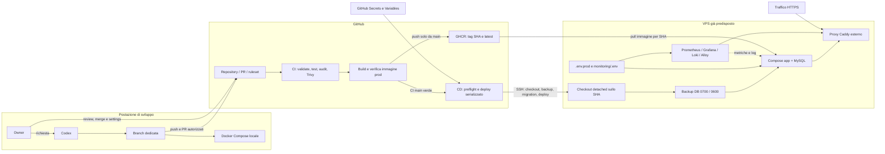

# Flusso e confini DevOps

Stato del repository al 21 agosto 2026. La mappa distingue ciò che è
automatizzato e versionato da ciò che richiede un'azione del proprietario o
accesso all'infrastruttura reale.

## Cosa dimostra il repository

- sviluppo e test ripetibili con Docker Compose;
- workflow GitHub Actions validati con actionlint e script con ShellCheck;
- build multi-stage dell'immagine prod e controllo dell'artefatto;
- gate Trivy su repository e immagine distribuita;
- immagini e Actions fissate a digest/SHA, aggiornabili via Dependabot;
- pubblicazione su GHCR e deploy dello stesso tag SHA verificato;
- preflight della configurazione prima dell'SSH;
- backup con permessi restrittivi e prova periodica di restore isolato;
- healthcheck dell'immagine, rollback applicativo e runbook di incidente;
- monitoring versionato e verificato sul VPS con metriche, log e notifiche
  Telegram.

## Confini di sicurezza

- La CI ha permessi di lettura sul repository; non accede al VPS.
- Soltanto la CD riceve le credenziali SSH e legge il package GHCR.
- `.env.prod` e `docker/monitoring/.env` restano sul VPS e non transitano da
  GitHub Actions.
- Il deploy allinea checkout e immagine sullo stesso SHA completo.
- Il proxy e Alloy leggono il socket Docker e cAdvisor usa mount/capability
  dell'host: sono rischi espliciti, annotati come hardening facoltativo.
- Un `HEALTHCHECK` rende osservabile un servizio non sano; la policy
  `restart: unless-stopped` non riavvia automaticamente un processo ancora
  vivo ma `unhealthy`.

## Stato delle verifiche esterne

Sono completati e verificati:

- Repository Secrets/Variables e ruleset di protezione di `main`; un GitHub
  Environment non è stato adottato e non è necessario al workflow;
- deploy tramite CD dello stesso SHA pubblicato su GHCR;
- monitoring sul VPS: target Prometheus tutti `UP`, `mysql_up == 1`, Loki e
  Alloy operativi e notifica Telegram consegnata.

Il repository non automatizza il bootstrap di un nuovo server: OS, SSH,
firewall, Docker e DNS restano responsabilità dell'installazione. L'unica
azione calendarizzata sull'installazione corrente è la decisione sulle
eccezioni Trivy in scadenza il 31 agosto 2026. Hardening host, restore di un
dump reale e metriche applicative aggiuntive sono possibilità non bloccanti,
classificate nel [piano di miglioramento](../PIANO_MIGLIORAMENTO_TEMPLATE.md).

Il proxy esterno può essere eliminato in futuro per semplificare lo stack, ma
solo dopo avere assegnato esplicitamente terminazione TLS, routing di Grafana,
persistenza dei certificati e raccolta delle metriche. Nell'assetto corrente è
un componente intenzionale, non una duplicazione accidentalmente rimasta.
